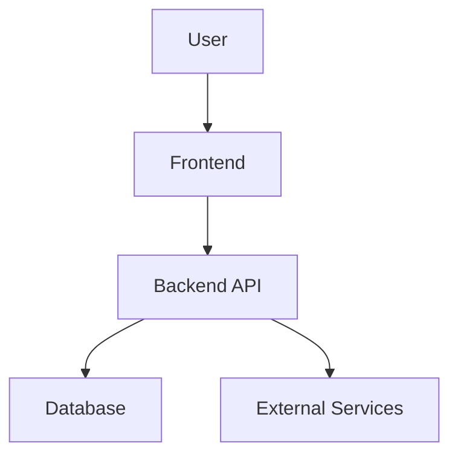
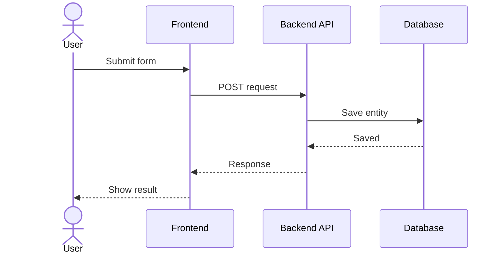

# Architecture

## High-level architecture

## Components

| Component | Responsibility | Technology |
|---|---|---|
| Frontend | TBD | TBD |
| Backend API | TBD | TBD |
| Database | TBD | TBD |

## Data flow

## Security

- Auth:
- Authorization:
- Secrets:
- Sensitive data:

## Deployment

- Environment:
- Hosting:
- Build command:
- Run command:
- Variables:
