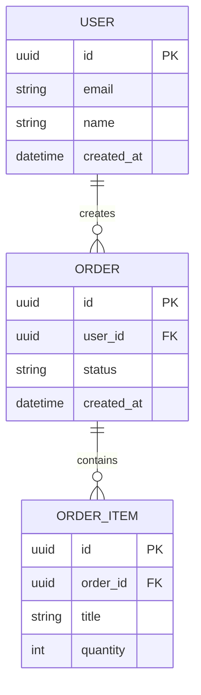

# Data Model

## ER diagram

## Entities

### EntityName

| Field | Type | Required | Notes |
|---|---|---|---|
| id | uuid | yes | Primary key |

## Indexes

- TBD

## Constraints

- TBD

## Data lifecycle

- Create:
- Update:
- Delete/archive:
